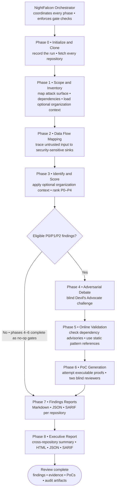

# NightFalcon Agentic Security Harness

NightFalcon is an open-source, multi-client harness for deep adversarial security review. One enforced nine-phase workflow runs in Claude Code, Codex, or Cursor and produces evidence-backed findings, blind Devil's Advocate adjudication, proof-of-concept review, SARIF, per-repository reports, and a cross-repository executive report.

## Install

Clone NightFalcon before installing the integration for your client:

```bash
git clone https://github.com/intuit/nightfalcon.git ~/NightFalcon
```

### Claude Code

1. Start Claude Code.
2. Register the NightFalcon marketplace:

   ```text
   /plugin marketplace add ~/NightFalcon/claude
   ```

3. Install the plugin:

   ```text
   /plugin install nightfalcon@nightfalcon-local
   ```

4. Run `/plugin list` and confirm that `nightfalcon` is enabled. If Claude Code asks you to reload plugins, run `/reload-plugins`.

See the [Claude Code integration guide](claude/README.md) for update, removal, and usage instructions.

### Codex

1. Register the NightFalcon marketplace:

   ```bash
   codex plugin marketplace add ~/NightFalcon/codex
   ```

2. Install the plugin and verify that Codex recognizes it:

   ```bash
   codex plugin add nightfalcon@nightfalcon-open
   codex plugin list
   ```

3. Configure Codex in the trusted project's `.codex/config.toml` or your `$CODEX_HOME/config.toml`. `max_depth` must be at least 5. `max_threads = 8` is recommended; Codex defaults to 6 when it is omitted, and values below 3 are blocked:

   ```toml
   [agents]
   max_depth = 5
   max_threads = 8
   ```

4. Restart Codex, start a new task, run `/hooks`, and trust the NightFalcon hooks.

See the [Codex integration guide](codex/README.md) for configuration, update, removal, and usage instructions.

### Cursor

The current Cursor integration is project-scoped. It is not packaged as a Cursor Marketplace plugin, so its files must be present in every Cursor review workspace.

1. Create or choose the directory where NightFalcon should write the review artifacts, then copy the Cursor integration into that workspace:

   ```bash
   cp -R ~/NightFalcon/cursor/.cursor /path/to/review-workspace/
   cp -R ~/NightFalcon/cursor/{phases,scripts,references} /path/to/review-workspace/
   ```

2. Make the hook and gate scripts executable:

   ```bash
   cd /path/to/review-workspace
   chmod +x .cursor/hooks/*.sh scripts/*.sh
   ```

3. Open the review workspace in Cursor and trust the project hooks when prompted.

See the [Cursor integration guide](cursor/README.md) for usage and architecture details.

## Client entry points

| Client | Package | Entry point |
|---|---|---|
| Claude Code | [`claude/`](claude/) | `/nightfalcon:nightfalcon` |
| Codex | [`codex/`](codex/) | `$nightfalcon` |
| Cursor | [`cursor/`](cursor/) | `/nightfalcon` |

## Usage

1. Create an empty directory for the review. NightFalcon uses the current directory as its workspace and writes all review artifacts there.

   ```bash
   mkdir ~/nightfalcon-review
   cd ~/nightfalcon-review
   ```

2. Start Claude Code or Codex from that directory:

   ```bash
   claude
   # or
   codex
   ```

   For Cursor, first copy the project-scoped integration into `~/nightfalcon-review` as described above, then open that directory as the workspace. If the `cursor` shell command is installed, you can run `cursor .` from the directory.

3. Invoke the installed integration:
   - Claude Code: `/nightfalcon:nightfalcon`
   - Codex: `$nightfalcon`
   - Cursor: `/nightfalcon`
4. When prompted, provide one or more Git repository references. NightFalcon accepts HTTPS URLs, SSH URLs, and GitHub references in `owner/repository` form. You can also include the repositories in the initial command. Your shell must already be authenticated for any private repositories.

Optional: add organization context so findings reflect your organization's policies, controls, exceptions, and standards. Reviews run without this step. Copy the client package's `references/organization_context/` template outside the package, populate its schema-compatible `_graph.json`, and place any referenced Markdown or Obsidian notes beneath that provider root. Keep private context outside public source control, and point NightFalcon at the provider before starting the review:

```bash
export NIGHTFALCON_CONTEXT_ROOT=/path/to/your/organization_context
```

After you start a review, the NightFalcon orchestrator coordinates every phase, spawns isolated workers, runs gate checks before and after each phase, and enforces sequencing through `state.json`.



NightFalcon runs the following nine phases:

0. **Initialize and clone:** Records the run configuration and checks out every requested repository under `sourcecode/`. A clone failure stops the run rather than silently omitting a repository.
1. **Scope and inventory:** Maps the relevant attack surface, trust boundaries, dependencies, and optional organization context for each repository.
2. **Trace data flows:** Follows untrusted inputs to security-sensitive sinks and builds a cross-repository topology.
3. **Identify and score findings:** Applies relevant organization context, creates candidate findings, and assigns severity tiers from P0 through P4.
4. **Challenge the findings:** Sends eligible P0, P1, and P2 candidates through a blind Devil's Advocate review to dismiss, confirm, or mark unsupported claims for further review.
5. **Validate current risk:** Checks eligible dependency findings against current public vulnerability and advisory sources; stable vulnerability patterns use versioned static references.
6. **Generate and review proofs of concept:** Attempts to create a self-contained PoC for each eligible P0, P1, or P2 finding and records two blind-reviewer verdicts for each generated PoC. Refused, failed, or ineligible PoCs are recorded as skipped.
7. **Build per-repository reports:** Produces Markdown, JSON, and SARIF findings for each repository.
8. **Build the executive report:** Produces the consolidated cross-repository summary, interactive HTML report, JSON, and aggregate SARIF.

## What NightFalcon analyzes

- external and internal attack surfaces, entry points, trust boundaries, and full source-to-sink flows;
- principal-action-object `relationship_context` for BOLA, including owner, same-tenant non-owner, cross-tenant, delegated, admin, anonymous, alternate selector, bulk, nested-object, and policy-drift paths;
- `business_logic_invariants`, including state transitions, concurrency, atomicity, isolation, idempotency, replay windows, quotas, cardinality, rollback, retry, and duplicate-delivery behavior;
- authoritative `cross_repository_topology`, reconciled only after all Phase 2 outputs, with matched, external, and unresolved edges;
- static `dependency_inventory` across runtime, development, optional, peer, feature, target, platform, profile, workspace, and lockfile declarations;
- vulnerable, compromised, confused-name, mutable, unmaintained, outdated, untracked, license, maturity, and oversized library risks. Reachability and resolution are separate evidence fields; unknown never means safe.

## Output

NightFalcon writes all artifacts into the review workspace. `<DATE>` is the run date from `state.json`; `<slug>` is the repository slug for each reviewed repo.

### Output formats

| Format | Primary files | Use |
|---|---|---|
| Markdown | `findings/<slug>/findings-<DATE>.md`, `output/executive-summary-<DATE>.md` | Human review, sharing with engineering teams |
| JSON        | `findings/<slug>/findings-<DATE>.json`, `output/executive-report-<DATE>.json`, `findings/<slug>/receipt-<DATE>.json` | Automation, diffing runs, audit tooling                    |
| SARIF       | `findings/<slug>/findings-<DATE>.sarif`, `output/executive-report-<DATE>.sarif`                                      | CI, GitHub Advanced Security, and other SARIF consumers    |
| HTML        | `output/executive-report-<DATE>.html`                                                                                | Interactive cross-repository summary in a browser          |
| PoC scripts | `output/proof_of_concept/<slug>/F-<NNN>-*.{sh,py,browser.json}`                                                      | Reproduce or validate a finding against a live environment |

Supporting artifacts include data-flow maps, dependency inventories, debate transcripts, PoC manifests, pattern tags, run logs, and Git checkpoints under `findings/<slug>/`, `output/`, and `sourcecode/`.

### Per-repository report contents

Each reported finding uses a stable `F-NNN` ID across every artifact. Reports may contain `CONFIRMED`, `CONFIRMED-MODIFIED`, or `NEEDS-REVIEW` findings; `NEEDS-REVIEW` means human validation is still required. The per-repo report includes:

- a business-context title and vulnerability category, including OWASP mapping where applicable;
- exact file paths and line ranges where the vulnerable code lives;
- what the feature does, what control is missing, and the business impact if exploited;
- step-by-step attack instructions specific enough to act as a proof-of-concept outline;
- verbatim code evidence from the reviewed repository;
- a concrete fix recommendation at the correct layer;
- severity spelled out with reachability, exploitability, impact, and patch status;
- CVSS v4.0 Base score and vector, plus CWE/CVE references when applicable; and
- links to any generated PoC script and its validation status.

The report also lists dismissed findings with the debate reason, so reviewers can see what was challenged and rejected during the run.

### Reproducibility and vulnerable code locations

`findings/<slug>/receipt-<DATE>.json` binds the review to the exact analyzed commit SHA, plugin version, and SHA-256 hashes of every source file referenced by a finding. Use it to confirm which findings still apply after the repository changes.

`findings/<slug>/dataflow-<DATE>.md` and `dataflow-<DATE>.json` show how untrusted input reaches security-sensitive sinks. `findings/<slug>/debate-<DATE>.md` records the blind Devil's Advocate transcripts for higher-severity candidates.

To reproduce a finding operationally, fill in the environment-specific values documented in the per-repo PoC guide and run the linked script under `output/proof_of_concept/<slug>/`, or use `output/proof_of_concept/run-all.sh` to batch-run every PoC. Cloned source remains under `sourcecode/<slug>/` for manual inspection and source-check PoCs. PoCs may not work out of the box: the underlying issue may not be reachable in your environment, or the script may still be missing required runtime inputs such as session tokens, tenant IDs, hostnames, or other deployment-specific values that only you can supply.

Open the cross-repo HTML report after the run:

```bash
open output/executive-report-<DATE>.html
```

## Operational considerations

When reviewing NightFalcon output, treat findings in three categories:

1. **True positives:** Findings that human review or successful reproduction confirms as actual defects. Higher-severity findings include adversarial-debate records and may include a reviewed PoC. Prioritize remediation according to validated severity and deployment reachability.
2. **Not reachable in practice:** The code pattern looks vulnerable, but another layer blocks exploitation in production, such as a gateway, WAF, service mesh, authorization service, or infrastructure control. NightFalcon analyzes only the repositories you provide. If the blocking layer lives in a repo that was not included in the review, NightFalcon may still report the issue because it cannot see that external mitigation. Validate reachability in your full deployment context before closing these items.
3. **False positives:** Because NightFalcon is LLM-driven, some reported defects may not exist. Debate records rejected candidates as `DISMISSED`, while ambiguous candidates may remain `NEEDS-REVIEW` in the report. Cross-check against source code, run the PoC where available, and repeat the review before acting.

Additional guidance:

- **Model refusals:** NightFalcon uses the model selected in the client and never switches models automatically. If the selected model repeatedly declines security-analysis tasks, choose a model that permits more of the workflow. A model with fewer refusals may produce different or lower-quality analysis. Specialized cybersecurity models, including Mythos and Daybreak, may decline fewer security-review requests.
- **Repeat and cross-validate reviews:** LLM output is probabilistic. A single run can miss vulnerabilities or report false positives caused by hallucinations. For higher confidence, run NightFalcon three or four times and cross-validate findings against the source code, supporting evidence, and generated PoCs before acting on them.

## OWASP coverage

Bundled mappings track current official editions available on 2026-08-26: Web 2025, API 2023, Mobile 2024, LLM 2026, Agentic Applications 2026, Kubernetes 2025, MCP 2025 beta, Non-Human Identities 2025, Smart Contract 2026, Business Logic Abuse 2025, and ASVS 5.0.0. Agentic Skills remains marked public-review draft. See [`owasp-provenance.json`](owasp-provenance.json) and [`shared/owasp/ATTRIBUTION.md`](shared/owasp/ATTRIBUTION.md).

NightFalcon includes and uses third-party software and reference materials. These components remain subject to their respective licenses and attribution requirements. See [`NOTICE`](NOTICE) and the license files distributed with individual components for details.

## Attribution

NightFalcon was developed by [Mukesh Aggarwal](https://www.linkedin.com/in/mukeshaggarwal/) and [Abhinav Verma](https://www.linkedin.com/in/secureabhinavverma/) from Intuit's Cybersecurity team in collaboration with OpenAI's Cybersecurity team.

NightFalcon also relies on the following third-party projects and materials:

- **OWASP project material:** condensed category mappings and reference metadata used for security-review coverage. See [OWASP coverage](#owasp-coverage) and [`NOTICE`](NOTICE).
- **[tree-sitter](https://tree-sitter.github.io/):** optional external CLI and language grammars used during review to build name-based call graphs. tree-sitter is not bundled with NightFalcon; operators install it separately when they want call-graph corroboration.
- **CVSS v4.0 scoring:** `cvss_v4.py` in each port is a Python port of the [FIRST CVSS v4 reference algorithm](https://github.com/FIRSTdotorg/cvss-v4-calculator).
- **[PyYAML](https://pyyaml.org/):** used by the vendored Codex plugin and skill validators in development and CI workflows.
- **Vendored Codex validator snapshots:** self-contained copies of OpenAI Codex plugin and skill validation scripts under `codex/scripts/validators/`, kept so standalone CI does not depend on a local Codex installation.

See [`NOTICE`](NOTICE), [`LICENSE`](LICENSE), and the license files distributed with individual components for applicable terms and attribution requirements.

## Disclaimer

NightFalcon is provided "as is" without warranty of any kind. Because it is LLM-based, results may include false positives. Output from this tool does not constitute a complete security assessment, penetration test, or guarantee that a system is free of vulnerabilities. Use only on repositories and systems you are authorized to assess. You are responsible for how you use this software and for complying with applicable laws and policies.

## Contributing and security

See [`CONTRIBUTING.md`](CONTRIBUTING.md), [`SECURITY.md`](SECURITY.md), and [`CODE_OF_CONDUCT.md`](CODE_OF_CONDUCT.md). Apache-2.0 terms are in [`LICENSE`](LICENSE).