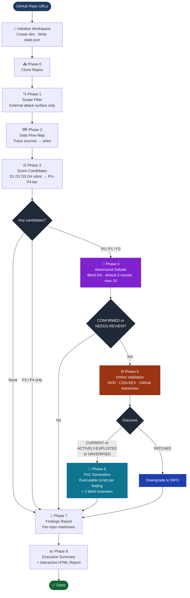

# Adversarial Security Review Plugin

A Claude Code plugin that audits a list of GitHub repositories for
security vulnerabilities and produces a focused report for each one.
The report covers the **external attack surface** — endpoints exposed
to public or authenticated callers, the authentication and authorization
paths that protect them, file-handling logic, and external-facing
dependencies — and surfaces a small number of high-confidence findings,
each one explained from the user-impact down to the exact code change
required to fix it.

Every finding goes through a recorded adversarial debate before reaching
the report. A blind Devil's Advocate — a separate agent with no access
to the original reasoning — tries to dismiss each finding by showing the
path isn't reachable, the input is already sanitized, or the impact is
bounded. Findings that survive the debate land in the report; findings
that don't are recorded as dismissed with the reasoning preserved. The
result is a report where every P0 means something specific, not a
SAST-style alert stream that wastes reviewer time on false positives.

---

## What you get

After a run completes, you get **two kinds of output**:

### A per-repository findings report

For each repo, a markdown file with one section per confirmed finding.
Each finding includes:

- **A newspaper-headline title** — *"Any authenticated customer can download
  any other tenant's customer statements"*, not *"IDOR in client-view
  controller"*.
- **What kind of issue this is** — plain-English taxonomy with the OWASP
  category.
- **Where in the code this lives** — exact files and line ranges.
- **What happens** — a story. What the feature does for its real user,
  what the server's contract is supposed to be, what check is present,
  what check is missing, what the attacker walks away with.
- **How the attack works, step by step** — numbered actions specific
  enough to double as a proof-of-concept.
- **Evidence from the code** — verbatim source snippets.
- **How to fix it** — the exact change at the right layer, named APIs.
- **Severity, spelled out** — four bullets covering reachability,
  impact, exploit difficulty, and patch status.

### An interactive cross-repo HTML report

A single-file HTML report (`executive-report-<DATE>.html`) you open in
a browser. It shows:

- A summary tab with the cross-repo headline, the recurring patterns
  across repos, and any high-confidence corrections the validation step
  produced.
- A repositories tab with a filterable, searchable list of every repo.
  Click any row to open the full per-repo findings in a modal.
- Severity badges (P0 / P1 / P2 / P3 / P4 / Clean) coloured for quick
  scanning.

Plus per-repo machine-readable artifacts (receipt JSON, dataflow JSON,
pattern tags) for tooling and audit.

---

## Install / Remove

NightFalcon ships as a Claude Code plugin via a local marketplace
listing in this directory (`.claude-plugin/marketplace.json`). All steps
below run inside a Claude Code session unless prefixed with a shell
prompt.

### Install

1. **Clone the repo** (shell):
   ```bash
   git clone https://github.com/intuit/nightfalcon.git ~/NightFalcon
   ```

2. **Register the local marketplace** (Claude Code):
   ```
   /plugin marketplace add ~/NightFalcon/claude
   ```
   Accepts any local path containing `.claude-plugin/marketplace.json`.
   The marketplace name `nightfalcon-local` comes from
   that file.

3. **Install the plugin from the marketplace** (Claude Code):
   ```
   /plugin install nightfalcon@nightfalcon-local
   ```
   The plugin name `nightfalcon` comes from `.claude-plugin/plugin.json`.

4. **Verify** (Claude Code):
   ```
   /plugin list
   ```
   `nightfalcon` should show as enabled. The namespaced
   `/nightfalcon:nightfalcon` slash command, the `nightfalcon` skill, and the
   Stop/PreToolUse hooks are
   now active.

### Update (after pulling new commits)

```
/plugin marketplace update nightfalcon-local
/plugin update nightfalcon@nightfalcon-local
```

### Picking up local edits (developing the plugin in-place)

Claude Code **caches the plugin by version number** under
`~/.claude/plugins/cache/nightfalcon-local/nightfalcon/<version>/`.
Editing files in this repo does **not** affect the running plugin
until the cache is refreshed — and `/reload-plugins` alone will not
refresh it if the version is unchanged.

1. Bump `"version"` in **both** `.claude-plugin/plugin.json` and
   `.claude-plugin/marketplace.json` (e.g. `1.5.0` → `1.5.1`).
2. Run `/reload-plugins` in Claude Code.
3. Verify the new cache picked up your edit:
   ```bash
   head -1 ~/.claude/plugins/cache/nightfalcon-local/nightfalcon/<new-version>/phases/phase-6.md
   ```

Skipping the version bump means the session keeps running the stale
cached copy even though your working tree changed.

### Remove

1. **Uninstall the plugin** (Claude Code):
   ```
   /plugin uninstall nightfalcon@nightfalcon-local
   ```
   This removes the slash command, skill, and hooks but leaves the
   marketplace registered.

2. **Remove the marketplace** (Claude Code, optional):
   ```
   /plugin marketplace remove nightfalcon-local
   ```

3. **Delete the clone and cache** (shell, optional):
   ```bash
   rm -rf ~/NightFalcon
   rm -rf ~/.claude/plugins/cache/nightfalcon-local
   ```

---

## How to use it

Claude Code always namespaces plugin-provided skills as
`/<plugin-name>:<skill-name>`. Invoke this plugin as
`/nightfalcon:nightfalcon`; the unqualified form is not a supported plugin
invocation.

### 1. Make a workspace and `cd` into it

```bash
mkdir ~/my-security-review
cd ~/my-security-review
```

The plugin uses your current directory as the workspace. The findings,
reports, and intermediate artifacts all land here. There's no prompt
asking where to put them — wherever you `cd`, that's the workspace.

### 2. Start Claude Code in that directory

```bash
claude
```

### 3. Run the slash command with the repos you want reviewed

```
/nightfalcon:nightfalcon https://github.com/org/repo-a https://github.com/org/repo-b
```

You can pass any number of repository URLs (HTTPS, SSH, or `<org>/<repo>`
short form). The plugin clones each repo, runs the full review pipeline,
and writes the findings + HTML report to your workspace.

When it's done, open the HTML report:

```bash
open output/executive-report-*.html
```

### Model: user selected; optional advisory provenance

By default every phase, every Devil's Advocate, and every PoC reviewer
runs on the **session default model** — whatever you selected in Claude
Code with `/model`. The plugin never asks which model to use, never
overrides it per phase, and never falls back to a different model when a
subagent refuses or errors (earlier versions had a phase-6 fallback chain
— run model → Sonnet → Haiku — that switched models on refusal and never
switched back; it degraded results and was removed in v2.0.0).

Change the active model with Claude Code's `/model` control. Optional
`--model <label>` records advisory run-start provenance only; it does not
select, pin, retry, or route any worker:

```
/nightfalcon:nightfalcon --model <model-id> https://github.com/org/repo-a
```

The label is persisted in `state.json`, but every new worker still uses the
model currently selected by the user. Already-running workers keep their
launch model. Omit `--model` when no advisory label is needed.

### Triage an existing findings backlog (`--triage`)

Instead of discovering bugs from source, you can point NightFalcon at a pile
of findings you already have — from another scanner, a prior model, or
bug-bounty intake — and have it **re-adjudicate** them: the blind Devil's
Advocate disproves and downgrades the false positives, leaving a short,
trustworthy, re-ranked list.

```
/nightfalcon:nightfalcon --triage path/to/findings.json --repo path/to/source
```

- Accepts SARIF, generic JSON, CSV, or a markdown table.
- `--repo` is optional; with it the debate can read the real code, without it
  it adjudicates on the backlog's claims and any embedded code excerpts.
- Triage is single-repo (one backlog → one repo). Split a multi-repo backlog
  and run it once per repo.
- It skips clone/scope/data-flow/scoring and enters directly at the
  adversarial debate, then validation → report → HTML — the same trustworthy
  output, applied to your existing list.

### Resuming an interrupted run

If a run is interrupted (network blip, Claude Code restart, anything),
just re-invoke the slash command in the same workspace. The plugin
detects the existing state and picks up at the phase that didn't finish.

### Reviewing different repositories

To start a fresh review on a different set of repos, `cd` to a new empty
directory and invoke the command again. One workspace per review keeps
things tidy.

---

## How it works

The plugin runs a sequence of phases. Each phase is a subagent with a
specific job; the output of one phase is the input to the next. The
shell gate scripts make sure no phase starts before its inputs exist
and no phase finishes without writing its outputs.

**Lean orchestrator.** The orchestrator only *coordinates* — it runs the
gate scripts, spawns one subagent per phase, and advances `state.json`.
It deliberately does **not** read the phase prompt files into its own
context. Instead it passes each subagent the path to its phase prompt
(`phases/<phase>.md`) and the subagent reads it in its own, transient
context. This matters because the orchestrator is a single long-lived
conversation: anything it holds is re-read on every subsequent turn, so
keeping its context small keeps the run cheap. A controlled A/B
measurement showed that having the subagent read its own prompt (rather
than the orchestrator reading it) cut orchestrator token cost by roughly
60% with no change to phase behavior or outputs — every phase's inputs
are files and literals, never the orchestrator's conversation memory.



### What each phase does, in plain English

**Phase 0 — Clone the repos.** Each GitHub URL becomes a folder under
`sourcecode/<repo-slug>/`. Any clone failure (auth, network, permissions)
blocks phase 0 so review cannot silently omit a registered repository.

**Phase 1 — Scope filter.** The reviewer reads the repo and decides what
counts as the *external* attack surface: HTTP endpoints reachable by
external users, authentication and authorization logic for those
endpoints, file handlers exposed externally, externally-loaded
dependencies. Internal admin tools, tests, build scripts, and pure
config files are excluded — they're not in scope for an external
adversarial review.

**Phase 2 — Data flow map.** For every in-scope endpoint, the reviewer
traces how untrusted data flows from where it enters (request body,
headers, query params) to anywhere it could cause harm (a database
query, a shell command, an HTML response, an authentication check).
Each flow is rated HIGH, MEDIUM, or LOW suspicion. This is where the
real analytical work happens.

**Phase 3 — Score candidates.** Every suspicious flow becomes a
*candidate finding*. The reviewer writes up what the feature is
supposed to do, what's wrong, the verbatim evidence, and the proposed
fix — then scores each candidate on four dimensions: who can reach it
(attack vector), what it costs if exploited (impact), how hard the
attack is (exploitability), and patch status. The four scores roll up
to a tier (P0 most severe, P4 informational).

**Phase 4 — Adversarial debate.** This is the trust mechanism. Every P0,
P1, and P2 candidate goes through a debate against a *blind* Devil's
Advocate — a fresh subagent that sees only the code excerpt and the
specific claim, never the original reviewer's reasoning, never other
findings, never scoring rationale. The DA tries to dismiss the finding
by showing it's not reachable, already mitigated, or out of scope. The
Primary defends; either side concedes when the other's evidence is
overwhelming, or the debate runs up to three rounds. Findings that
survive land in the report; findings that don't are dismissed with the
reasoning recorded. This is what makes a "P0" mean something.

Once a finding is confirmed, the same phase runs **variant analysis**: a
confirmed bug is rarely the only instance of its shape, so NightFalcon
hunts the rest of the codebase (using the call graph and targeted search)
for other sites with the same structural weakness and raises each as its
own candidate — `variant-of` the original. Variants are not trusted by
similarity; each one independently goes through the blind debate and
must survive on its own. (Variant analysis is a discovery feature, so it
runs only in a full review, not in triage mode.)

**Phase 5 — Online validation.** For dependency-CVE findings, the
reviewer searches NVD, GitHub Advisories, and CISA's known-exploited
catalog to confirm the CVE is current and check whether the repo's
pinned version is already past the patch line. (Pattern-class findings
like SQLi or XSS use a static citation table instead — those categories
are stable.) Findings whose CVE was already patched get downgraded;
findings actively exploited in the wild get flagged.

**Phase 6 — Proof-of-concept generation.** For every P0/P1/P2 finding
that survived the debate (CONFIRMED, CONFIRMED-MODIFIED, or
NEEDS-REVIEW — only debate-DISMISSED findings are excluded; for a
NEEDS-REVIEW finding the script is what settles the open question),
the reviewer translates the textual attack steps into an
executable script — `.sh` (curl-shell / source-check), `.py`
(python), or a `.browser.json` browser recipe when a script cannot
confirm — under `proof_of_concept/<slug>/` at the workspace root.
Every environment-specific value (target host, auth token, victim
tenant ID, …) is read from the single workspace-root
`proof_of_concept/poc-config.env`, shared by every repo's PoCs — the
developer fills that one file and runs the single invoker
`proof_of_concept/run-all.sh` (or any script). Each config key carries a
`What / Used by / Why` comment naming which PoCs need it and what the
value drives in the attack. Two independent blind reviewer subagents
— each seeing only the script, the claim, the code excerpt, and the
declared placeholder list — verdict the script as `VALID`,
`NEEDS-REVISION`, or `INVALID`. One regeneration round is allowed on
`NEEDS-REVISION`. The verdict, script path, and required config keys
land in `poc-manifest-<DATE>.json` and surface in the findings report
and HTML modal as a clickable link with a "requires: KEY1, KEY2…"
line.

**Phase 7 — Per-repo findings report.** The reviewer writes the
user-facing finding for each confirmed result — the title, the story,
the steps, the evidence, the fix. Each "What happens" paragraph follows
the business-context-first rule: it opens with a real user role and
closes with the victim's business consequence, not the attack
mechanism.

**Phase 8 — Cross-repo executive summary and HTML report.** The reviewer
writes the cross-repo summary, identifies recurring patterns across
multiple repos (e.g., "hardcoded API keys in client bundles across
twelve repos"), and a deterministic Python script builds the
interactive HTML report from the structured per-repo data.

---

## Factors that drive output quality

Three design choices shape what ends up in the report.

### Every P0/P1/P2 finding goes through a recorded adversarial debate

Before a finding reaches the report, a blind Devil's Advocate — a
separate agent that sees only the code excerpt and the specific claim,
never the original reasoning or other findings — tries to dismiss it.
The DA's job is to show the path isn't reachable, the input is already
sanitized, the impact is bounded, or the dependency isn't actually
loaded. The original reviewer defends. Either side concedes when the
other's evidence is overwhelming, or the debate runs up to three rounds.
Both sides' reasoning is recorded in the debate transcript. Findings
that survive land in the report; findings that don't are kept in a
"Dismissed" section with the debate reasoning preserved, so the
dismissal itself is auditable.

The DA's independence is enforced, not just intended. Each DA runs as a
fresh, isolated subagent — a new one per round and per finding, never
reused, never evaluated inline — and is handed *only* the single code
excerpt, the one-sentence claim, and the current round's statement. It
never sees the scoring, the tier, the original reviewer's reasoning,
other findings, or any earlier phase output. If a DA ever detects it can
see context it shouldn't, it returns `BLIND_VIOLATION` and is re-spawned
cleanly. A DA that can see the reviewer's reasoning gets anchored by it
instead of genuinely testing the claim — so the isolation is the point.

### Findings open with the affected user and close with the business consequence

The "What happens" paragraph for each finding follows a fixed shape: it
starts with a real-world user role (an account manager, a billing admin, a
contractor) and what the affected feature does for that user, and it
ends with the business consequence on successful exploitation — *"any
authenticated customer can read another tenant's customer statement PDFs, which contain SSN,
payee addresses, and gross payment amounts"*. The technical mechanism
(the missing access check, the unsanitised sink) is recorded between
those two anchors, not in place of them. Both engineering managers
prioritising work and engineers implementing fixes get what they need
from the same paragraph.

### Dependency findings are validated against current CVE / advisory databases in the same run

For findings tied to a specific dependency version, the plugin queries
NVD, GitHub Security Advisories, and CISA's Known Exploited
Vulnerabilities catalog live during the run. An already-patched CVE
gets downgraded; one actively exploited in the wild gets flagged with
its source URL. Pattern-class findings (SQLi, XSS, IDOR, etc.) — which
don't have CVE IDs and whose CWE/OWASP mapping is stable on
multi-year timescales — use a versioned static citation table instead,
avoiding the cost of redundant lookups. Online queries use only
generic terms (framework + vulnerability class + year); no repo-
identifying strings leave the host.

---

## What this plugin does NOT do

To set expectations honestly:

- **It is not a SAST tool.** It doesn't enumerate every theoretical
  issue. It produces a small number of *defensible* findings with the
  reasoning to back each one.
- **It does not test the running application.** All analysis is static
  (reading source) plus online validation against public CVE / advisory
  databases. No payloads are sent to the target.
- **It does not exfiltrate code.** Online validation queries use only
  generic terms (framework + vulnerability class + year + CVE IDs).
  No repo names, file paths, function names, or code snippets are sent
  to any search engine. The full constraint is in `phases/phase-5.md`.
- **It does not run untrusted code from the repos.** Tree-sitter parses
  source without executing it; nothing the analyzed repo contains is
  evaluated.

---

## Reference

The sections below are reference material for maintainers, advanced
operators, and anyone debugging a run. First-time users do not need
to read past this point.

## Reproducibility & audit

The workspace is a git repo from the first phase, and every phase
boundary is a checkpoint commit (state.json + findings + output, with
`sourcecode/` excluded via `.gitignore`). Each per-repo run also
produces a `receipt-<DATE>.json` that pins the analyzed commit SHA,
the plugin version, and the SHA-256 of every source file referenced
by any finding. Comparing two receipts tells you exactly which
findings reference files that changed between runs and which were
unaffected — useful for "is this old finding still valid?" follow-up
questions without re-running the full review.

## State Persistence & Resume

`state.json` is written and updated after every phase:

```json
{
  "date": "YYYY-MM-DD",
  "current_phase": "phase-3",
  "repo_slugs": ["my-api", "auth-service"],
  "phase_status": {
    "phase-0": "completed",
    "phase-1": "completed",
    "phase-2": "completed"
  },
  "git_checkpoints": [
    { "phase": "phase-0", "sha": "abc123", "timestamp": "2026-04-20T14:30:45Z" }
  ],
  "history": [
    { "phase": "phase-0", "completed_at": "2026-04-20T14:30:45Z" }
  ]
}
```

On resume, the orchestrator reads `current_phase`, re-runs `check-gate.sh` for that phase, and continues from there. A git checkpoint is committed after every phase completes. Because every cross-phase handoff travels through files on disk (never the orchestrator's conversation memory), a run can resume — or the orchestrator's context can be reset between phases — without any loss of state or change to the output.

---

## Directory Structure

```
nightfalcon/
├── README.md                        ← this file
├── hooks/
│   ├── bash-guard.py                ← Bash mutation guard for protected review artifacts
│   └── hooks.json                   ← Stop + PreToolUse hooks (write, Bash, agent budget)
├── phases/
│   ├── phase-0.md                   ← Clone subagent prompt
│   ├── phase-1.md                   ← Scope filter subagent prompt
│   ├── phase-2.md                   ← Data flow map subagent prompt
│   ├── phase-3.md                   ← Issue ID & scoring subagent prompt
│   ├── phase-4.md                   ← Adversarial debate subagent prompt
│   ├── phase-5.md                   ← Online validation subagent prompt
│   ├── phase-6.md                   ← PoC generation subagent prompt
│   ├── phase-7.md                   ← Findings report subagent prompt
│   ├── phase-8.md                   ← Executive summary + HTML subagent prompt
│   ├── phase-da.md                  ← Devil's Advocate subagent prompt (phase-4 internal)
│   ├── phase-poc-reviewer.md        ← PoC reviewer subagent prompt (phase-6 internal)
│   └── triage-ingest.md             ← Triage-mode backlog ingest (--triage)
├── references/
│   ├── context-scope.md             ← Token budget limits per phase (~50K per subagent)
│   ├── state-schema.md              ← state.json schema definition
│   └── hook-setup.md                ← Hook registration instructions
├── scripts/
│   ├── init-review.sh               ← Workspace initialization
│   ├── check-gate.sh                ← Precondition + output + path enforcement
│   └── complete-phase.sh            ← Output verification + state.json + git checkpoint
└── skills/
    └── nightfalcon/
        └── SKILL.md                 ← Orchestrator skill definition (runs on your session model)
```

---

## Output Files

After a completed run, the workspace contains:

```
<workspace>/                                 ← always $PWD at command-invocation time (no prompt, no override)
├── .git/                                    ← workspace is a git repo; every phase boundary is a checkpoint commit
├── .gitignore                               ← excludes sourcecode/ from commits
├── state.json                               ← phase-status state machine
├── state-derived-summary.json               ← normalized tier/disposition/validation per finding (phase-8 reads this for tallies)
├── input/
│   └── repos-DATE.txt
├── findings/
│   └── <repo-slug>/
│       ├── dataflow-DATE.md                 ← attack surface + data flow map (human-readable, prose-first)
│       ├── dataflow-DATE.json               ← hybrid projection: prose field + structured enums (phase-3/4 consume)
│       ├── candidates-DATE.md               ← scored candidates + debate dispositions + validation
│       ├── debate-DATE.md                   ← full debate transcripts (P0/P1/P2 only) with typed envelopes
│       ├── findings-DATE.md                 ← final per-repo report (F-NNN IDs, business-context-first prose)
│       ├── findings-DATE.json               ← render-ready findings projection (phase-8 reads this, never re-emits)
│       ├── pattern-tags-DATE.json           ← per-repo cross-repo pattern tags (~200 bytes; phase-8 clustering input)
│       ├── receipt-DATE.json                ← reproducibility receipt (file SHAs, commit, rubric, debate metadata)
│       ├── callgraph-<lang>.json            ← optional tree-sitter call graph (one per language)
│       ├── callgraph-<lang>-summary.md      ← human-readable callgraph top-callers
│       └── callgraph-status-DATE.md         ← per-language callgraph build outcome
├── proof_of_concept/                        ← phase-6 output, top-level
│   ├── poc-config.env                       ← single root config: all placeholders + per-key What/Used-by/Why comments; fill once
│   ├── run-all.sh                           ← single root invoker: runs every PoC across all repos
│   ├── lib/poc-common.sh                    ← shared bash helpers
│   └── <repo-slug>/
│       ├── poc-manifest-DATE.json           ← PoC script paths + dispositions + placeholders + reviewer verdicts
│       └── F-NNN-<slug>.<ext>               ← executable PoC scripts (.sh/.py/.browser.json), all read the root poc-config.env
└── output/
    ├── run-log-DATE.md                      ← clone log + Multitenant-scope audit per repo
    ├── session-manifest.json                ← run provenance (started_at, ended_at, model, plugin version, phases_completed)
    ├── executive-summary-DATE.md            ← cross-repo aggregate markdown
    ├── executive-report-DATE.json           ← structured input the HTML builder consumes
    └── executive-report-DATE.html           ← interactive single-file HTML report
```

**`findings-DATE.json`** is the key per-repo artifact for phase-8
performance. Phase-7 captures each finding's render-ready fields
(`what_happens_md`, `attack_steps_md`, `evidence_md`, `fix_md`,
`severity_md`, plus title / tier / category / location / validation /
`poc`) as structured JSON. Phase-8 projects the `findings[]` array into
`executive-report-DATE.json` in canonical severity and finding-ID order,
without prose re-emission or re-rendering. This dropped phase-8 wall time from ~30 min to ~3-5 min
in large multi-repository reviews.

Note: `sourcecode/` (cloned repos) is deleted after phase-8 completes.

**Stable finding IDs.** Every finding gets an opaque `F-NNN` ID at the
moment it is raised in phase-3 (sequential per repo, zero-padded
three-digit). The same ID appears in the candidate record, debate
transcript, findings report, executive summary, and receipt — making
`grep F-042` work uniformly across every artifact a review produces.

**Reproducibility receipt.** `receipt-DATE.json` binds the review to
the exact `(commit_sha, SKILL.md SHA, analyzed-file SHAs)` triple. Two
receipts from different runs can be diffed to find which findings
reference files that changed and therefore must be re-validated.

**Tree-sitter call graphs (optional).** When tree-sitter is installed,
phase-1 builds name-based call graphs for Java, JavaScript, Python, and
Go. The graphs are **additive evidence** for phase-2 (sink reachability)
and phase-4 (debate corroboration) — never a gate. Absent or empty
graphs fall back to LLM-only reasoning with no penalty to findings.

**Provider P0 doctrine.** This plugin defaults to treating repos as
Multitenant-scope. Cross-tenant access by any self-provisioned identity is
P0 by construction. Phase-0 records the doctrine's applicability per
repo in the run log; the rubric anchors are documented in
`references/multitenant-p0-doctrine.md`.

---

## Scope: What Is and Is Not Reviewed

### In Scope
- HTTP/REST/GraphQL/gRPC endpoints reachable from the public internet
- Authentication and authorization logic
- File upload and download handlers
- External SDK integrations
- WebSocket message handlers
- Dependencies with external reachability

### Excluded
- Deployment scripts (Terraform, Ansible, Helm, Docker, CI/CD pipelines)
- Internal operations scripts and developer utilities
- Internal microservices (no external reachability)
- Cron and batch jobs
- Test code
- Database schema files
- Internal dashboards

---

## Vulnerability Taxonomy

Candidates are classified into these categories during phase-3:

- Remote Code Execution (CMDi, unsafe deserialization, template injection)
- Injection (SQLi, LDAPi, XPath, NoSQL injection)
- Broken Authentication (weak tokens, session fixation, insecure credential storage)
- Sensitive Data Exposure (secrets in code/logs, weak crypto, plaintext PII)
- XXE / SSRF
- Broken Access Control (missing authz, IDOR, privilege escalation)
- Security Misconfiguration (debug flags, permissive CORS, default credentials)
- XSS (reflected, stored, DOM-based)
- Insecure Deserialization
- Vulnerable Dependencies (known-CVE libraries)
- Cryptographic Failures (weak algorithms, hardcoded keys, IV reuse)
- Business Logic (auth bypass, race conditions, state manipulation)

---

## HTML Report Design

The phase-8 HTML report is a single self-contained file with no external CDN dependencies.

### Tier Color Scheme

| Tier | Text | Background | Border |
|------|------|------------|--------|
| P0 | #7f1d1d | #fef2f2 | #dc2626 |
| P1 | #7e22ce | #faf5ff | #9333ea |
| P2 | #9a3412 | #fff7ed | #ea580c |
| P3 | #854d0e | #fefce8 | #ca8a04 |
| P4 | #1e40af | #eff6ff | #2563eb |
| Clean | #166534 | #f0fdf4 | #16a34a |

### Structure
- Hero header: title, run date, repo count, five tier-colored count badges
- Two tabs: **Executive Summary** (prose) and **Repositories** (filterable list)
- Repository rows: slug, severity note, tier pill, per-tier count chips — click to open modal
- Filter bar: free-text search + tier chips (All / P0 / P1 / P2 / P3 / P4 / Clean)
- Per-finding accordion: P0 and P1 expand by default; P2–P4 collapsed
- "Expand all" / "Collapse all" buttons on each modal toolbar
- Responsive layout, breakpoint at 760px
